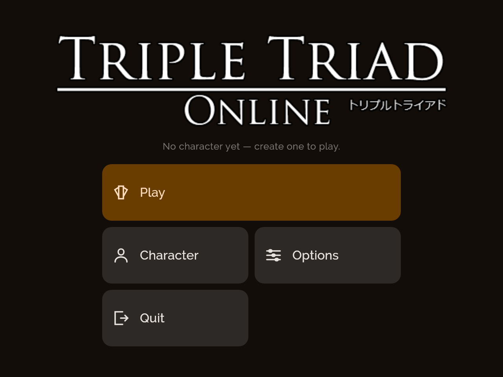
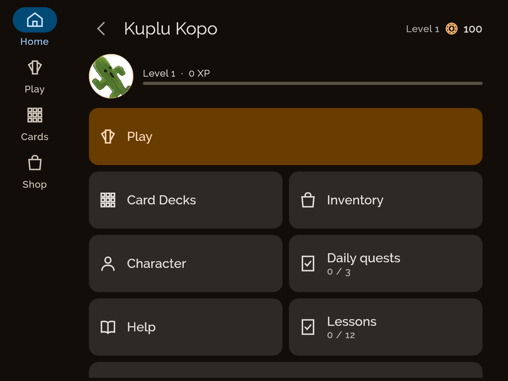
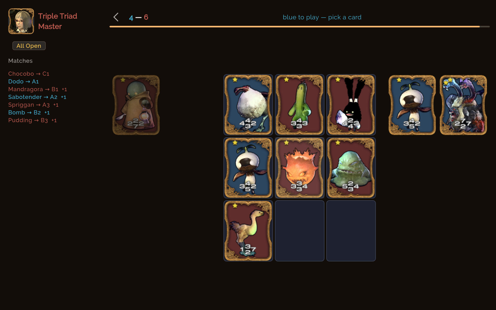
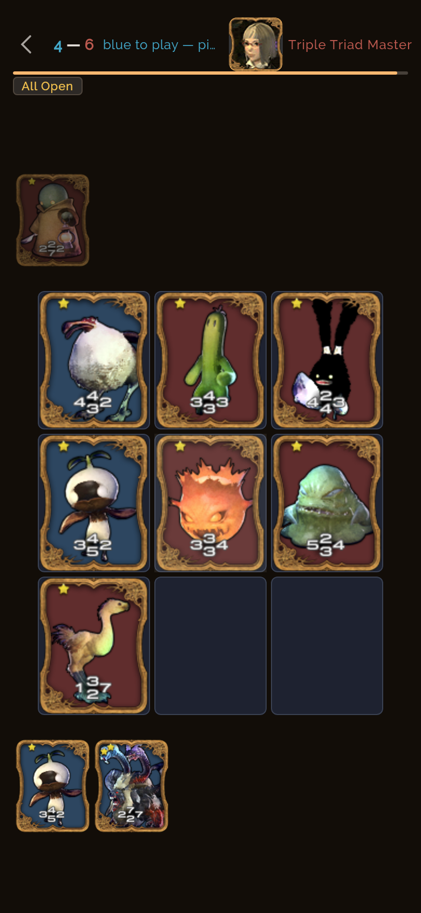
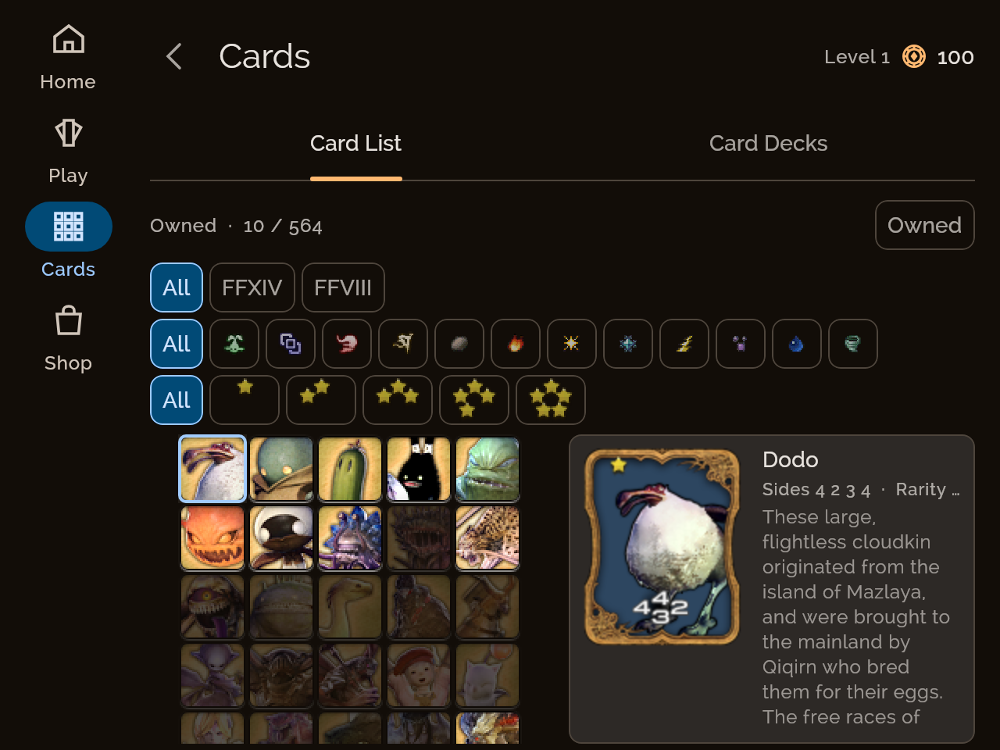
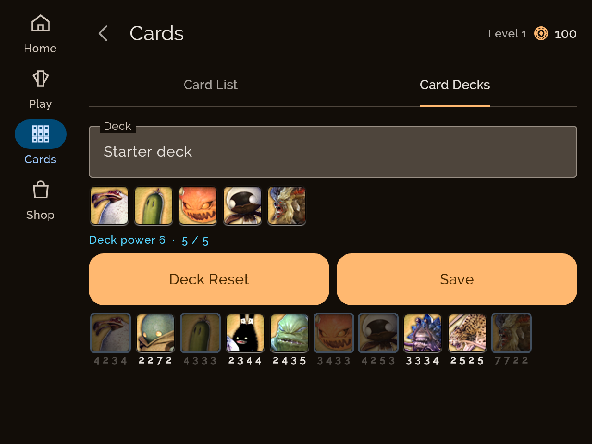
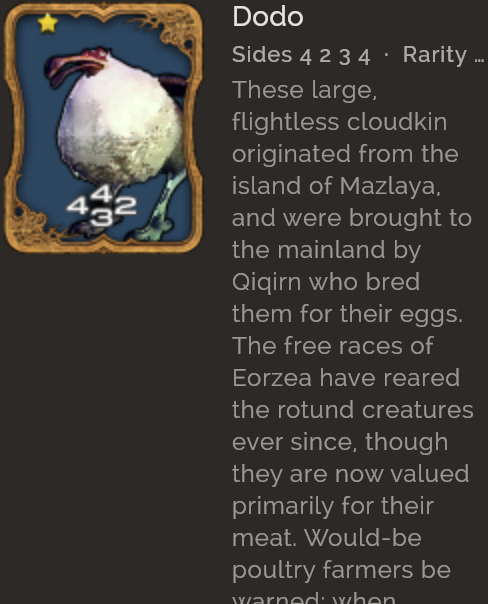
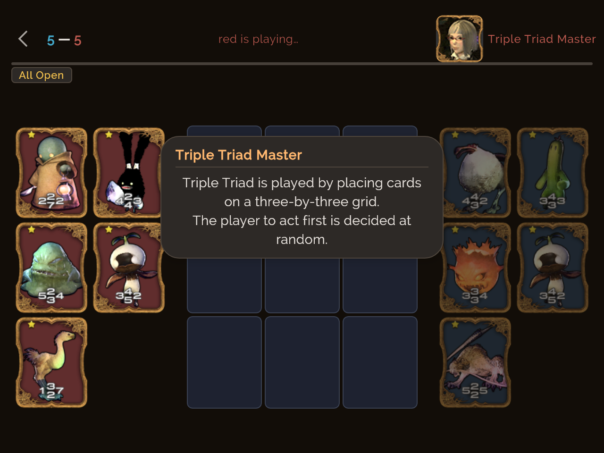
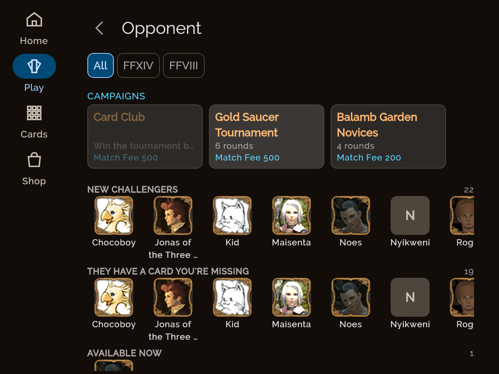

# Triple Triad — Kotlin Multiplatform Client

[](https://github.com/korobetski/tto-client/actions/workflows/build.yml)
[](https://opensource.org/licenses/MIT)
[](https://kotlinlang.org)
[](https://github.com/JetBrains/compose-multiplatform)

**A modern, cross-platform implementation of the classic Triple Triad card game from Final Fantasy series.**

Built with modern Kotlin Multiplatform and Compose technologies.

---

## Screenshots

| | |
|---|---|
| <br>**Main menu** | <br>**Dashboard** — the hub a character lands on |
| <br>**Match, landscape** — three cards down, All Open | <br>**Match, portrait** — the phone layout, not a scaled one |
| <br>**Collection** — grid and detail, two panes, 564 cards | <br>**Deck builder** — the starter deck open |
| <br>**Card detail** | <br>**Tutorial** — the first lesson, mid-sentence |
| <br>**Opponents** — ladders, then the shelves that say who is worth playing | |

### How these are taken

The app photographs itself. `ScreenshotCapture` (in `shared/src/desktopTest/`) drives the same
screens the UI tests drive, at a fixed window size and density, and writes the nine files above
into `docs/screenshots/`. No device, no emulator, and the same picture every run:

```bash
./gradlew :shared:desktopTest --tests "*ScreenshotCapture*" -Ptto.screenshots=1
```

Without `-Ptto.screenshots` every capture is skipped, so an ordinary `./gradlew build` neither
writes into the repository nor pays for the run. Adding a screenshot means adding a method there —
the landmark tag it waits on is what pins *which* screen it caught.

Two things to know before adding one. The landmark must be something the screen has actually
**composed**: a `LazyColumn` item below the fold never appears, so waiting on it only ever times
out. And the landscape board capture takes its own window (`BOARD`, 960 x 600 dp) rather than the
640 x 480 dp `DESKTOP` one, because a match is started through the opponent detail sheet and on a
480 dp-tall window that sheet's own challenge button falls outside the window — the same reason a
player cannot start a match on a window that short. The portrait capture is unaffected: a phone is
844 dp tall.

### From a real device

Worth having for the things a headless surface cannot show — system insets, a notch, the real
Android font scale:

```bash
# Capture and pull screenshot
adb shell screencap -p /sdcard/screenshot.png
adb pull /sdcard/screenshot.png docs/screenshots/

# On Windows (Git Bash), use:
MSYS_NO_PATHCONV=1 adb shell screencap -p /sdcard/screenshot.png
```

> **Not verified:** these are desktop (Skiko) renders at 2x density, not device captures. They are
> what the shared Compose tree draws; an Android or iOS host may differ in insets, font scale and
> system chrome.

---

## Table of Contents

- [Overview](#overview)
- [Features](#features)
- [Screenshots](#screenshots)
- [Project Structure](#project-structure)
- [Toolchain](#toolchain)
- [Prerequisites](#prerequisites)
- [Commands](#commands)
- [Game Features](#game-features)
- [Technical Highlights](#technical-highlights)
- [Running the App](#running-the-app)
- [Build Results](#build-results)
- [Localization](#localization)
- [Known Issues](#known-issues)
- [Licensing](#licensing)

---

## Overview

This repository contains a **Kotlin Multiplatform** client for Triple Triad, a strategic card game originally from Final Fantasy VIII and later expanded in Final Fantasy XIV, providing a native experience on multiple platforms.

### Supported Platforms

- **Android** — Full support with native UI
- **Desktop (JVM)** — Complete implementation for development and testing
- **iOS** — Framework compiles (SwiftUI host sources included, project setup pending)

---

## Features

### Implemented

The client currently implements **7 core systems**:

1. **Card Catalog** — All 263 cards loaded from JSON resources
2. **Card Rendering** — Faithful recreation of original card artwork with exact layer positioning
3. **Match System** — Complete 3x3 board gameplay with turn-based mechanics
4. **Rules Engine** — All game rules (Capture, Reverse, Fallen Ace, Same, Same Wall, Plus, Combo, Elemental, etc.)
5. **State Machine** — Match sequencing as pure state transitions
6. **App Framework** — Splash screen, main menu, options, and navigation
7. **Audio System** — Original game music and sound effects with dual-channel mixing

### Game Content

- **263 unique cards** across FF14 and FF8 collections
- **85 PvE opponents** with varying difficulty levels
- **2 tournament ladders** (Card Club and Gold Saucer Tournament)
- **Complete tutorial system** with 12 interactive lessons
- **4 languages** (English, French, German, Japanese)

### Technical Achievements

- **Single codebase** for all platforms using Kotlin Multiplatform
- **Compose Multiplatform UI** with shared components
- **96.8% line coverage** with gated CI checks
- **Zero detekt/ktlint warnings** (maxIssues = 0)
- **Pure functional rules engine** enabling server-side verification

---

## Project Structure

```
.
├── README.md                    # This file
├── CONTRIBUTING.md              # Development guidelines
├── CLAUDE.md                    # AI assistant context
├── settings.gradle.kts          # Module configuration
├── build.gradle.kts             # Build configuration
├── gradle/
│   └── libs.versions.toml       # Version catalog
├── shared/                      # KMP module (core logic + UI)
│   └── src/
│       ├── commonMain/kotlin/com/tripletriad/
│       │   ├── data/             # Data loaders, repositories
│       │   ├── storage/          # Save format handling
│       │   ├── net/              # Network client, session management
│       │   ├── i18n/             # Localization system
│       │   ├── audio/            # Audio player interface
│       │   ├── settings/         # User preferences
│       │   ├── log/              # Logging framework
│       │   ├── time/             # Clock abstraction
│       │   └── ui/               # Compose UI components
│       │       ├── theme/        # Design system (palette, typography)
│       │       ├── App.kt        # Root composable
│       │       ├── Screen.kt     # Navigation destinations
│       │       ├── Navigation.kt # Navigation components
│       │       ├── Controls.kt   # Shared UI controls
│       │       ├── Startup.kt    # Startup sequence
│       │       ├── MainMenuScreen.kt
│       │       ├── OptionsScreen.kt
│       │       ├── ProfileGate.kt / ProfileScreen.kt
│       │       ├── AccountSession.kt / AccountScreen.kt
│       │       ├── DashboardScreen.kt
│       │       ├── MatchScreen.kt / MatchBoard.kt
│       │       ├── CollectionScreen.kt
│       │       ├── DeckSelectorScreen.kt
│       │       ├── CardView.kt   # Card rendering
│       │       └── ...
│       └── commonMain/composeResources/files/
│           ├── cards.json        # Card catalog (generated)
│           ├── npcs.json          # PvE opponents (generated)
│           ├── campaigns.json    # Tournament ladders (generated)
│           ├── art/               # Card faces, avatars, portraits, icons
│           └── locales/           # Localization bundles
├── androidApp/                  # Android host
│   └── src/main/
│       └── kotlin/com/tripletriad/android/
│           ├── AndroidAudioPlayer.kt
│           ├── AndroidSettingsStore.kt
│           ├── MainActivity.kt
│           └── DocumentStore.kt
├── desktopApp/                  # JVM host
│   └── src/main/kotlin/
│       └── Main.kt
├── iosApp/                      # iOS host (SwiftUI)
│   └── *.swift
└── tools/                       # Extraction/import scripts
    ├── extract_cards.py       # Generates cards.json
    ├── import_card_art.py      # Imports card artwork
    ├── import_locales.py       # Normalizes locale bundles
    ├── import_sounds.py        # Imports sound files
    └── ...
```

---

## Toolchain

**[`gradle/libs.versions.toml`](gradle/libs.versions.toml) is the authority.** This table is a
copy and copies rot — it claimed Kotlin 2.2.20 and Compose 1.9.3 for several releases after the
catalog had moved on. Read the catalog when the number matters.

| Component | Version | Notes |
|-----------|---------|-------|
| **Gradle** | 9.6.1 | Via committed wrapper |
| **JDK** | 17 | `jvmToolchain(17)` in all modules |
| **Kotlin** | 2.4.10 | With Compose Multiplatform plugin |
| **Compose Multiplatform** | 1.11.1 | |
| **Material 3** | 1.9.0 | Versions separately from the rest of Compose since 1.11 |
| **`com.tripletriad:core`** | 0.7.3 | The rules engine; the server pins the same number |
| **Ktor** | 3.5.2 | Same version the server runs |
| **kotlinx.serialization** | 1.11.0 | JSON parsing |
| **kotlinx.coroutines** | 1.11.0 | |
| **Android Gradle Plugin** | 9.3.1 | For Android target |
| **ktlint** | 12.1.2 | Code formatting (configured via .editorconfig); held back deliberately — see the catalog |
| **detekt** | 1.23.8 | Static analysis (maxIssues = 0) |
| **JaCoCo** | Built-in | Code coverage, desktop target only — see [§ JaCoCo, not Kover](#jacoco-not-kover) |

---

## Prerequisites

### Required

- **JDK 17** on `PATH` or `JAVA_HOME`
- **GitHub token** with `read:packages` scope (for `com.tripletriad:core` dependency)
  - Add to `~/.gradle/gradle.properties`:
    ```properties
    gpr.user=<your-github-username>
    gpr.key=<token with read:packages>
    ```

### Android Specific

- **Android SDK** with platform 37 and build-tools
- `local.properties` file with `sdk.dir` path
  - On Windows, escape backslashes: `sdk.dir=C\:\Users\\<you>\\AppData\\Local\\Android\\Sdk`

---

## Commands

### Run the App

```bash
# Desktop (JVM) - Fastest iteration
./gradlew :desktopApp:run

# Android - Build debug APK
./gradlew :androidApp:assembleDebug

# Android - Install and launch
./gradlew :androidApp:installDebug
adb shell am start -n com.tripletriad.android/.MainActivity
```

### Build Everything

```bash
# Full build: compile, test, lint, format check
./gradlew build

# Fast test loop (856 tests, measured 2026-08-17)
./gradlew :shared:desktopTest

# Static analysis
./gradlew ktlintCheck detekt

# Code formatting
./gradlew ktlintFormat
```

## Game Features

### Card System

Each card has:
- **4 power values** (top, right, bottom, left) ranging from 1 to 10 (or A for 10)
- **Elemental type** (for Elemental rule): Beast, Garlean, Primals, Scions (FF14) or 8 elements (FF8)
- **Rarity** (1-5 stars)
- **Collection** (FF14 or FF8)

The **effective power range is 0-10** (Fallen Ace produces 0, Descension can reduce to 0).

### Rules Engine

All original rules are implemented and tested against a 35-case specification matrix:

| Rule | Description |
|------|-------------|
| **Basic Capture** | Higher adjacent power captures opponent's card |
| **Reverse** | Lower adjacent power captures (inverts comparison) |
| **Fallen Ace** | Ace (A) counts as 0 instead of 10 |
| **Same** | Equal adjacent powers capture |
| **Same Wall** | Card can capture using board edge as "wall" |
| **Plus** | Sum of adjacent powers captures when equal |
| **Combo** | Captured cards trigger chain captures |
| **Elemental** | Card powers modified by board element |
| **Order** | Must play cards in dealt order |
| **Chaos** | Random card selected from hand each turn |
| **Sudden Death** | First to capture 5 cards wins immediately |

### Match Flow

1. **Roulette** — Random rule selection
2. **Pre-match** — Random hand, Swap, Open, Coin flip options
3. **Turn-based play** — Alternating placements on 3x3 grid
4. **Scoring** — Count controlled cards at end of match

---

## Technical Highlights

### Architecture

- **Pure Functional Core**: Rules engine uses immutable data structures and pure functions
- **Separation of Concerns**: UI, audio, networking, and game logic are cleanly separated
- **Dependency Injection**: Clock and platform services are injected for testability

### UI/UX

- **Responsive Design**: Adapts to landscape and portrait orientations
- **Scale-Invariant**: Card and board scaling maintains exact geometry
- **Animation Fidelity**: Card flip animation matches original 400ms duration with 4-leg squash
- **Drag and Drop**: Full support alongside tap-to-play

### Performance

| Metric | Value |
|--------|-------|
| Cold start (Android) | ~650-750ms |
| Memory usage (idle) | ~72.4 MB PSS |
| Line coverage | **96.8%** |
| Branch coverage | **78.9%** |

### Testing

- **523 distinct tests** across common and platform-specific modules
- **786 total test executions** (common tests run on multiple targets)
- **Zero failures** in CI pipeline
- **Coverage gated** in build (fails if below thresholds)

---

## Running on Real Devices

### Android

```bash
# From command line
./gradlew :androidApp:installDebug
adb shell am start -n com.tripletriad.android/.MainActivity

# From Android Studio
1. Open repository root
2. Select androidApp configuration
3. Run on device/emulator
```

### Desktop

```bash
./gradlew :desktopApp:run
```

### Useful ADB Commands

```bash
# View logs
adb logcat -s AndroidRuntime:E System.err:W

# Simulate tap (for testing)
adb shell input tap 1200 450

# Capture screenshot
adb shell screencap -p /sdcard/s.png && adb pull /sdcard/s.png

# On Windows (Git Bash):
MSYS_NO_PATHCONV=1 adb shell screencap -p /sdcard/s.png

# Uninstall
adb uninstall com.tripletriad.android
```

---

## Verified Build Results

| Platform | Command | Result |
|----------|---------|--------|
| Shared Tests | `:shared:desktopTest` | **856 tests, 0 failures** (measured 2026-08-17) |
| Android host tests | `:shared:testAndroidHostTest` | **396 tests, 0 failures** (measured 2026-08-17) |
| Coverage | `:shared:coverageReport` | **95.0% line, 75.8% branch**, desktop target only (measured 2026-08-17) |

**Not verified in this pass** — the row below was last confirmed at the cited numbers and has not
been re-run since; APK sizes and full-build task counts drift with every dependency bump and are
not worth pinning in prose:

| Platform | Command | Result |
|----------|---------|--------|
| All | `./gradlew clean build` | BUILD SUCCESSFUL last confirmed, task/size figures not re-measured |
| Android Debug / Release | `:androidApp:assembleDebug` / `assembleRelease` | BUILD SUCCESSFUL last confirmed |
| Desktop | `:desktopApp:build` | BUILD SUCCESSFUL last confirmed |
| Lint | `ktlintCheck detekt` | BUILD SUCCESSFUL last confirmed (0 issues) |

### Device Testing

Verified on **Pixel 6a, Android 17 (API 37), arm64-v8a**:

- ✅ Installation and launch
- ✅ Both landscape and portrait orientations
- ✅ Card artwork rendering with correct layering
- ✅ Capture mechanics and flip animations
- ✅ Touch input and gesture handling
- ✅ Complete match gameplay
- ✅ Audio playback (music and effects)
- ✅ Localization (French and Japanese tested)

---

## Localization

Four languages are supported:

| Language | Code | Status |
|----------|------|--------|
| English | `en_US` | ✅ Complete |
| French | `fr_FR` | ✅ Complete |
| German | `de_DE` | ✅ Complete (some mistranslations noted) |
| Japanese | `ja_JA` | ✅ Complete |

### Localization Structure

```
shared/src/commonMain/composeResources/files/locales/
├── tto-en_US.json    # Original Square Enix strings (688 keys) - DO NOT EDIT
├── tto-fr_FR.json    # French translation
├── tto-de_DE.json    # German translation
├── tto-ja_JA.json    # Japanese translation
├── app-en_US.json    # App-specific strings (172 keys) - EDIT THESE
├── app-fr_FR.json    # French app strings
├── app-de_DE.json    # German app strings (empty - falls back to English)
└── app-ja_JA.json    # Japanese app strings (empty - falls back to English)
```

The split between `tto-*` and `app-*` bundles:
- **`tto-*`**: Original Square Enix content (must remain unchanged)
- **`app-*`**: New strings added by this port (safe to modify)

---

## Design System

The app uses a **custom Material 3-based design system** defined in:

- [`ui/theme/Palette.kt`](shared/src/commonMain/kotlin/com/tripletriad/ui/theme/Palette.kt) — Six tonal ramps
- [`ui/theme/Colors.kt`](shared/src/commonMain/kotlin/com/tripletriad/ui/theme/Colors.kt) — Color roles
- **Raleway font** — Regular as normal, Medium as bold

### Card Geometry

| Element | Dimensions | Position |
|---------|------------|----------|
| Card sprite | 104 × 128 dp | — |
| Color quad | 88 × 118 dp | (8, 5) |
| Digit cluster | 44 × 30 dp | (28, 88) |
| `cdbg` plate | 28 × 28 dp | (8, 1), α=0.5 |
| Digits | 18 × 18 dp | Various positions |
| Rarity stars | 29 × 28 dp | (9, 6) relative to face |
| Type icon | 20 × 20 dp | (80, 3) relative to face |
| Artwork | 104 × 128 dp | (0, 0) over color quad |

---

## Audio System

The original **22 sound files** have been analyzed:

| Property | Values |
|----------|---------|
| Codec | MPEG-1/2 Layer III (MP3) |
| Sample rates | 22,050 / 44,100 / 48,000 Hz |
| Channels | 21 mono, 1 stereo (music) |
| Bitrate | 17 VBR, 5 CBR |
| Total | 22 files, 1.40 MB, 84.5s |

**10 sounds are used** in the port (out of 22 original):

| Moment | Sound File | Source |
|--------|------------|--------|
| Match music (looping from 16.374s) | `shuffle_or_boogie` | BaseMatchScreen.as:114 |
| Hands dealt | `se_ttriad.scd_2` | openPhase() |
| Placed (no capture) | `se_ttriad.scd_1` | TTOCore.as:87 |
| Card captured/flipped | `se_ttriad.scd_157` | Card.as:229 |
| Combo propagation | `se_ttriad.scd_15` | TTOCore.as:125 |
| Turn change | `se_ttriad.scd_4` | BaseMatchScreen.as:374 |
| Blue wins | `se_ttriad.scd_7` | PVEMatchScreen.as:95 |
| Red wins | `se_ttriad.scd_8` | PVEMatchScreen.as:139 |
| Control tapped | `se_ui.scd_72` | TouchLabel.as:31 |
| Next match | `se_gs.scd_162` | RematchPanel.as:36 |

### Implementation

- **Dual-channel mixing**: Background music and sound effects on separate channels
- **SoundPool** for short effects (overlapping allowed)
- **MediaPlayer** for music (streaming with seek support)
- **No Media3 dependency** — Uses platform APIs directly

---

## Rules Engine Details

The rules engine (`tto-core`) is implemented as **pure Kotlin** with:

```kotlin
// Core types
GameRules      // 12 rule slots (3 enums + 9 booleans)
Board          // Immutable 3×3 grid, positions 0..8 row-major
AscensionTally // Board-wide per-type counter
RulesEngine    // Capture resolution, precedence, combo propagation
TurnOrder      // 9 placements: 5 for first player, 4 for second
```

### Key Design Decisions

1. **Same and Plus use effective powers**, not printed values
2. **Same Wall fires with a single neighbour**
3. **Mutually exclusive rules** — Ascension/Elemental cannot be enabled together

These are **configurable** via `RulesEngineOptions`:
- `RulesEngineOptions.FAITHFUL` — Reproduces the legacy behavior (including the printed-value defect)
- Default — Uses corrected behavior

---

## Screens and Navigation

The app has **21 destinations** arranged in a tree structure:

```
SPLASH → MENU → PROFILES → PROFILE_NEW (no server)
                    ACCOUNT → COLLECTION_CHOICE (with server)
                       │
                       ▼
                    DASHBOARD → OPPONENTS → MATCH
                               │          └─ deck selector
                               │
                               ├── STATS → AVATAR
                               ├── CARDS / DECKS (tabs)
                               ├── SHOP / INVENTORY (tabs)
                               ├── CAMPAIGN → CAMPAIGN_MATCH
                               ├── TUTORIAL
                               └── HELP

MENU → OPTIONS
MENU → onQuit
```

### Navigation Features

- **Tree-based**: Maximum depth of 3, forks at dashboard
- **Back handling**: Android system gesture supported via `BackHandler`
- **No Compose Navigation**: Uses custom `Screen.up` and conditional routing
- **Platform-agnostic**: Works on Android, Desktop, and will work on iOS

---

## User Settings

Stored in `UserSettings.json` with **3 fields**:

```json
{
  "language": "fr_FR",
  "background_volume": 1.0,
  "noise_volume": 1.0
}
```

| Host | Path |
|------|------|
| Android | `Context.filesDir/UserSettings.json` |
| Desktop | `~/My Games/Triple Triad Online/UserSettings.json` |

### Features

- **Immediate apply**: Changes take effect without Save button
- **Corruption repair**: Invalid files are repaired, not fatal
- **Language persistence**: First run seeds from device language
- **Dual volume control**: Separate channels for music and effects

---

## Known Issues

### Current Limitations

1. **No frame-timing measurement** — `dumpsys gfxinfo` not yet integrated
2. **No card-internal layout assertions** — Visual regression tests needed
3. **Easing curves differ** — Starling vs Compose easing functions
4. **Portrait is custom** — Original was landscape-only, port adds portrait support
5. **Card scaling approach** — Multiplies geometry vs scaling render layer

### iOS Status

- ✅ Framework compiles on macOS CI
- ✅ Common tests pass on iOS simulator
- ⏳ No `.xcodeproj` yet (requires macOS to create)
- ⏳ No iOS app has been built or tested

To complete iOS support:
1. Create Xcode project on macOS
2. Add `iosApp/*.swift` to target
3. Add build phase: `./gradlew :shared:embedAndSignAppleFrameworkForXcode`

### Deprecation Warnings

Three warnings from plugin internals (all scheduled for Gradle 10):
- `ReportingExtension.file(String)` — from detekt
- `archives configuration` — from Kotlin Multiplatform
- `multi-string dependency notation` — from Kotlin Multiplatform

---

## What's Proven and What's Left

### ✅ Proven by Execution

- Kotlin 2.4.10 + Compose Multiplatform 1.11.1 + Ktor stack works
- Single `commonMain` UI runs on Android and JVM
- All 28 of original's 32 screens implemented
- Complete rules engine with server-side verification
- Drag-and-drop + tap input in common code
- Accounts, sessions, offline queue over Ktor
- Local Docker/Postgres container integration
- Original artwork (263 cards, 27 avatars, 84 portraits, 20 captions)
- 4-language localization
- 95.0% line coverage / 75.8% branch, desktop target (measured 2026-08-17)

### 📋 Remaining

1. **Local PvP** — the online path is built and server-mediated (`net/PvpClient.kt`: tables, queue,
   challenges, moves, claims). What is *not* built is a peer-to-peer or same-device transport; that
   is still undecided.
2. **iOS app** — Framework compiles, needs Xcode project setup
3. **Store release** — Out of scope by decision

---

## Card Rendering Reference

| Element | Value |
|---------|-------|
| Card sprite | 104×128 |
| Colored face | 88×118 at (8,5) |
| Blue card color | `0xFF2D4660` |
| Red card color | `0xFF602D2D` |
| Grey card color | `0xFF5A595A` |
| Digit cluster position | (28, 88), bounds 44×30 |
| `cdbg` plate | 28×28 at (8,1), α=0.5 |
| Power order | top/right/bottom/left |
| Power 10 renders as A | Uses `cdA` texture — no `cd10` in digits.xml |
| Card flip animation | 400ms, 4-leg squash |

---

## Licensing Note

⚠️ **This repository contains Square Enix material**

The following files contain Square Enix IP:
- `cards.json` — Names and stats of all 263 cards
- `art/*` — Card faces, thumbnails, avatars, portraits, icons, captions
- `locales/tto-*.json` — Original localization strings
- `androidApp/src/main/res/raw/*.mp3` — Original sound files

**BR-003** (unlicensed Square Enix IP) from the risk assessment is **unresolved and blocking**. If resolved by reskinning, only the names in `cards.json` would need replacement — card stats (powers, rarity, type) are separate from naming.

---

## Contributing

See [CONTRIBUTING.md](CONTRIBUTING.md) for development guidelines, code of conduct, and contribution process.

---

## Related Repositories

- **[tto-core](https://github.com/korobetski/tto-core)** — Rules engine library (consumed as `com.tripletriad:core`)
- **[tto-server](https://github.com/korobetski/tto-server)** — Live server (consume `com.tripletriad:core`)

---

## Documentation

- **[Development Guides](docs/development/)** — Setup, build, testing guides

---

*Built with ❤️ using Kotlin, Compose, and a lot of reverse engineering.*

*Original game: Triple Triad from Final Fantasy series © Square Enix*
