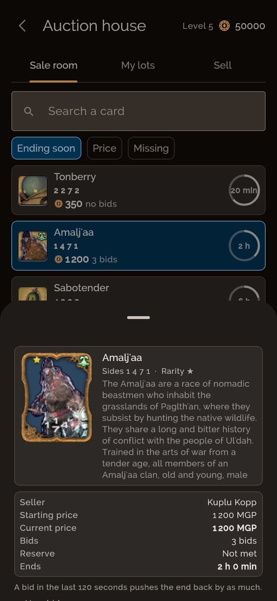
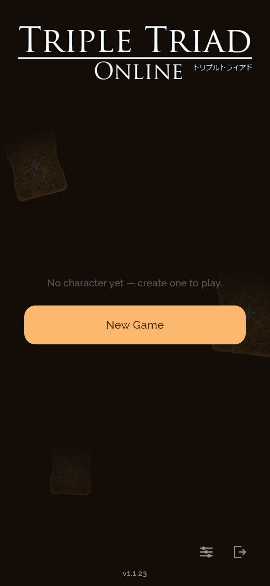
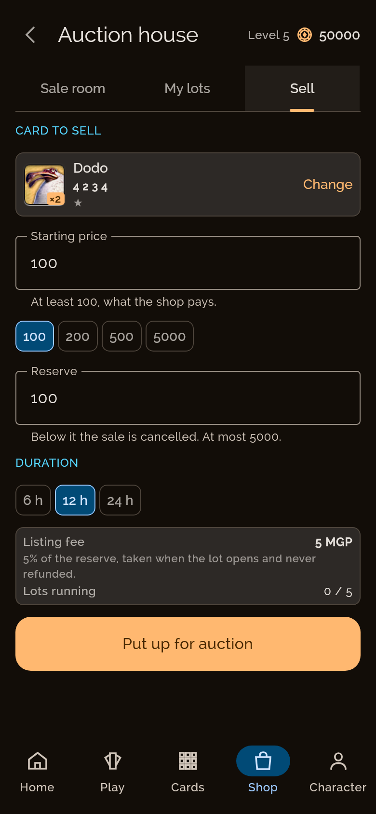
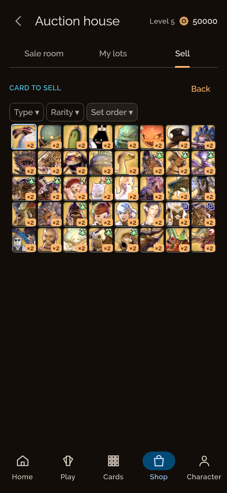
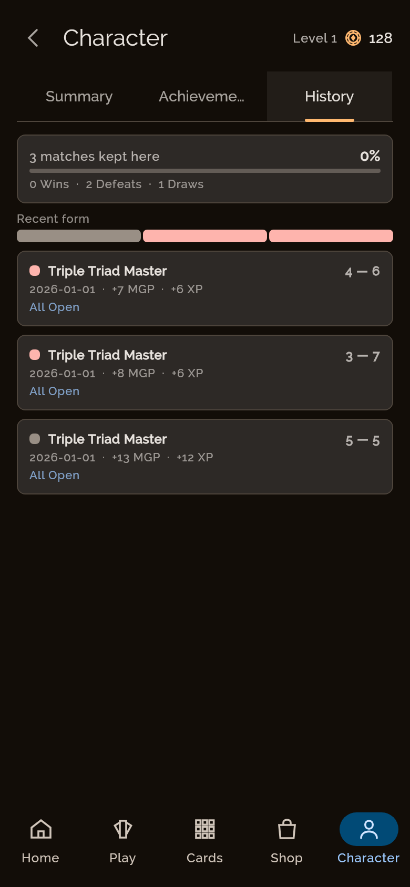
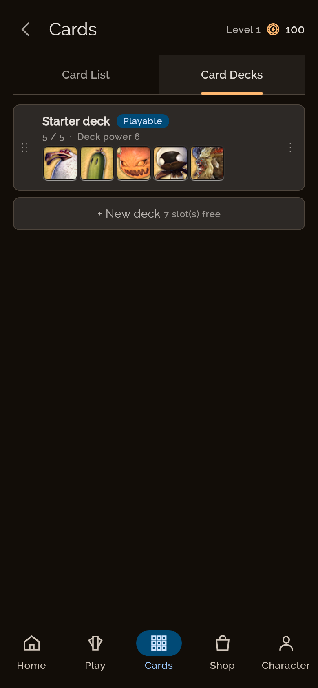

<div align="center">

# Triple Triad Online

**The Final Fantasy card game, online — on Android, Windows, macOS, Linux and in the browser.**

<a href="https://playtto.moebiuscore.fr"></a>
<a href="https://github.com/korobetski/tto-client/releases/latest"></a>
<a href="https://tto.moebiuscore.fr"></a>

[](https://github.com/korobetski/tto-client/actions/workflows/build.yml)
[](https://kotlinlang.org)
[](https://github.com/JetBrains/compose-multiplatform)
[](https://discord.gg/cPZW74AUTj)


</div>

---

A cross-platform remake of **Triple Triad**, the card game of Final Fantasy VIII and Final Fantasy
XIV: one Kotlin Multiplatform codebase, one Compose UI, and a server that replays every match with
the same engine before it pays out.

**Just want to play?** Open **[playtto.moebiuscore.fr](https://playtto.moebiuscore.fr)**, or pick an
installer from the [latest release](https://github.com/korobetski/tto-client/releases/latest). News,
the rules and account sign-up are on **[tto.moebiuscore.fr](https://tto.moebiuscore.fr)**.

## Contents

- [The game](#the-game)
- [Screenshots](#screenshots)
- [Platforms](#platforms)
- [Part of Triple Triad Online](#part-of-triple-triad-online)
- [Getting started](#getting-started)
- [Project structure](#project-structure)
- [Localization](#localization)
- [Quality gates](#quality-gates)
- [Status](#status)
- [Licensing note](#licensing-note)

---

## The game

| | |
|---|---|
| 🃏 **586 cards** | across two sets, Final Fantasy XIV and Final Fantasy VIII, each with its own art, rarity and type |
| 🗺️ **189 opponents** | in 25 campaigns — the Card Club, the Gold Saucer tournament, and places from Ul'dah to Trabia |
| 📜 **15 rules** | Same, Plus, Reverse, Fallen Ace, Elemental, Ascension, Sudden Death… plus Combo, which is always on. [Every rule, animated →](https://tto.moebiuscore.fr/en/rules/) |
| 🎲 **3 formats** | FFXIV standard, FFVIII standard, and free play with every rule and every card |
| ⚔️ **Player vs player** | tables and challenges, refereed move by move by the server |
| 🏛️ **Auction house** | buy and consign cards, with a desk that shows what the house charges |
| 📈 **Progression** | collection, decks, packs, the shop, achievements, daily quests and match history |
| 🎓 **Tutorial** | lessons that teach the game one rule at a time |
| 🌍 **4 languages** | English, French, German and Japanese |

A match is played on a 3×3 board: each card placed attacks its neighbours, and the higher number
takes the card facing it. The rest is the rules — and the server, which replays the transcript with
[the same engine](https://github.com/korobetski/tto-core) to decide what really happened.

## Screenshots

<table>
  <tr>
    <td width="50%"><br><b>Dashboard</b> — the hub a character lands on</td>
    <td width="50%"><br><b>Match, portrait</b> — the phone layout, not a scaled one</td>
  </tr>
  <tr>
    <td><br><b>Collection</b> — the grid with the screen to itself</td>
    <td><br><b>Auction house</b> — the sale room, with a lot open at the desk</td>
  </tr>
</table>

<details>
<summary><b>More screenshots</b> — title, deck builder, card detail, tutorial, opponents, history…</summary>

<br>

| | |
|---|---|
| <br>**Title screen** | <br>**Deck builder** — the starter deck open |
| <br>**Card detail** — the panel, as the sheet over the grid carries it | <br>**Tutorial** — the first lesson, mid-sentence |
| <br>**Consignment desk** — a card, two prices and what the house charges | <br>**Consignment picker** — the collection's own grid and filters, over what is spare |
| <br>**Opponents** — ladders, then the shelves that say who is worth playing | <br>**Match history** — the tally, the recent form, and what each match paid |
| <br>**Decks** — the decks a profile has, one line for the slots it has not filled | |

</details>

<details>
<summary><b>How these are taken</b> — the app photographs itself</summary>

<br>

`ScreenshotCapture` (in `shared/src/desktopTest/`) drives the same screens the UI tests drive, at a
fixed window size and density, and writes the files above into `docs/screenshots/`. No device, no
emulator, and the same picture every run. Every picture but the landscape board is a phone,
390 × 844 dp — the shape the app is mostly used at, and the one that shows the sheets and full-width
grids a wide window hides.

```bash
./gradlew :shared:desktopTest --tests "*ScreenshotCapture*" -Ptto.screenshots=1
```

Without `-Ptto.screenshots` every capture is skipped, so an ordinary `./gradlew build` neither
writes into the repository nor pays for the run. Adding a screenshot means adding a method there —
the landmark tag it waits on is what pins *which* screen it caught.

Three things to know before adding one. The landmark must be something the screen has actually
**composed**: a `LazyColumn` item below the fold never appears, so waiting on it only ever times
out. The landscape board takes its own window (`BOARD`, 960 × 600 dp) because a match is started
through the opponent detail sheet, whose challenge button falls outside a shorter one — the same
reason a player cannot start a match on a window that short. And the auction house cannot be
photographed off the shipped data: it needs a counterparty and a profile past its level gate, so
that capture builds a `PveStubServer` and hands it the lots.

> **Not verified:** these are desktop (Skiko) renders at 2x density, not device captures. They are
> what the shared Compose tree draws; an Android or iOS host may differ in insets, font scale and
> system chrome. For those, capture from a real device:
>
> ```bash
> adb shell screencap -p /sdcard/screenshot.png && adb pull /sdcard/screenshot.png docs/screenshots/
> ```
>
> From Git Bash on Windows, prefix the first command with `MSYS_NO_PATHCONV=1`.

</details>

---

## Platforms

| Platform | Status | Get it |
|---|---|---|
| 🌐 **Browser** (Wasm) | ✅ live | [playtto.moebiuscore.fr](https://playtto.moebiuscore.fr) — `:webApp`, deployed from a tagged release |
| 🤖 **Android** | ✅ signed APK | [latest release](https://github.com/korobetski/tto-client/releases/latest) |
| 🪟 **Windows** | ✅ `.msi` | [latest release](https://github.com/korobetski/tto-client/releases/latest) — SmartScreen asks once: *More info → Run anyway* |
| 🍎 **macOS** | ✅ `.dmg` | [latest release](https://github.com/korobetski/tto-client/releases/latest) — not code-signed: open it the first time with right-click → Open |
| 🐧 **Linux** | ✅ `.deb` | [latest release](https://github.com/korobetski/tto-client/releases/latest) |
| 📱 **iOS** | ⏳ framework only | compiles and passes the common tests on the simulator; no Xcode project yet |

## Part of Triple Triad Online

| | Repository | Role |
|---|---|---|
| 🃏 | **tto-client** — *you are here* | the game, on every platform above |
| ⚙️ | [tto-core](https://github.com/korobetski/tto-core) | the rules engine, consumed as `com.tripletriad:core` — the client plays with it, the server replays with it |
| 🛡️ | [tto-server](https://github.com/korobetski/tto-server) | the authority: accounts, progression, refereeing |
| 🌐 | [tto.moebiuscore.fr](https://tto.moebiuscore.fr) | the public site — news, rules, downloads and sign-up |

---

## Getting started

### Prerequisites

- **JDK 17** on `PATH` or `JAVA_HOME`
- **A GitHub token with `read:packages`**, for `com.tripletriad:core`. GitHub Packages answers an
  anonymous request with 401 even for a public package. In `~/.gradle/gradle.properties`, outside
  the repository:
  ```properties
  gpr.user=<your-github-username>
  gpr.key=<token with read:packages>
  ```
- **For Android:** the Android SDK with platform 37 and build-tools, and a `local.properties` with
  `sdk.dir` (`cp local.properties.sample local.properties`). On Windows, escape the backslashes:
  `sdk.dir=C\:\\Users\\<you>\\AppData\\Local\\Android\\Sdk`

### Run it

```bash
# Desktop — the fastest iteration loop
./gradlew :desktopApp:run

# Android — build, install and launch
./gradlew :androidApp:installDebug
adb shell am start -n com.tripletriad.android/.MainActivity

# Browser — served on http://localhost:8082, the API forwarded to a local server on 8080
# (-Ptto.apiServer=<url> for another one)
./gradlew :webApp:wasmJsBrowserDevelopmentRun
```

### Build and test

```bash
./gradlew build                          # compile, test, lint, coverage gate
./gradlew :shared:desktopTest            # the fast test loop
./gradlew :shared:wasmJsBrowserTest      # the common tests again under wasm, in headless Chrome and Firefox
./gradlew :webApp:wasmJsBrowserDistribution   # the browser bundle: webApp/build/dist/wasmJs/productionExecutable/
./gradlew ktlintCheck detekt             # static analysis
./gradlew ktlintFormat                   # fix formatting
```

### Toolchain

[`gradle/libs.versions.toml`](gradle/libs.versions.toml) **is the authority**; this table is a copy,
and copies rot. Read the catalog when the number matters.

| Component | Version | Notes |
|---|---|---|
| Gradle | 9.7.1 | via the committed wrapper |
| JDK | 17 | `jvmToolchain(17)` in all modules |
| Kotlin | 2.4.20 | |
| Compose Multiplatform | 1.12.0 | Material 3 versions separately, at 1.9.0 |
| `com.tripletriad:core` | 0.12.5 | the rules engine; the server pins the same number |
| Ktor | 3.6.0 | |
| kotlinx.serialization / coroutines | 1.11.0 / 1.11.0 | |
| Android Gradle Plugin | 9.4.1 | |
| ktlint plugin / detekt | 12.1.2 / 1.23.8 | ktlint held back deliberately — see the catalog |

---

## Project structure

```
.
├── shared/                  # the KMP module: everything but the platform hosts
│   └── src/commonMain/
│       ├── kotlin/com/tripletriad/
│       │   ├── ui/          # every screen, the match board, the theme
│       │   ├── net/         # the server client: accounts, PvE, PvP, auctions
│       │   ├── data/        # loaders and repositories
│       │   ├── storage/     # the save format
│       │   ├── i18n/        # localization
│       │   ├── audio/       # the audio player interface
│       │   └── settings/ log/ notify/ platform/ time/
│       └── composeResources/files/
│           ├── cards.json, npcs.json, campaigns.json, formats.json, starters.json
│           ├── art/, banners/, fonts/
│           └── locales/     # tto-* (original strings) and app-* (this port's)
├── androidApp/              # Android host
├── desktopApp/              # JVM host — and the Windows, macOS and Linux installers
├── webApp/                  # browser host (Wasm)
├── iosApp/                  # iOS host (SwiftUI), not yet an Xcode project
└── docs/
    ├── development/         # how the project is written, tested and released
    └── screenshots/
```

---

## Localization

| Language | Code | |
|---|---|---|
| English | `en_US` | ✅ reference |
| French | `fr_FR` | ✅ complete |
| German | `de_DE` | ✅ nearly complete — a few dozen app strings fall back to English |
| Japanese | `ja_JA` | ✅ nearly complete — a few dozen app strings fall back to English |

The bundles in `shared/src/commonMain/composeResources/files/locales/` come in two families:

- **`tto-*`** — the original Square Enix strings. **Do not edit.**
- **`app-*`** — the strings this port adds. Safe to modify; a missing key falls back to English.

---

## Quality gates

- **ktlint + detekt** with `maxIssues = 0` — any finding fails the build
- **Coverage floor of 90% line / 75% branch** on the desktop target, which `check` depends on —
  JaCoCo, not Kover, for the reason recorded in `shared/build.gradle.kts`
- **Common tests on several targets** — desktop, Android host, and wasm in two browsers
- **A pure rules engine** in [tto-core](https://github.com/korobetski/tto-core), which is what makes
  server-side verification possible at all

The details — the development standards, the build and testing guides, and reference material from
the port (card geometry, the original sounds, dated measurements) — are in
**[docs/development/](docs/development/)**. New here? Start with
[CONTRIBUTING.md](CONTRIBUTING.md).

---

## Status

**Done:** every platform above but iOS; accounts, solo campaigns and refereed PvP against the live
server; the auction house; the shop, packs, achievements and quests; four languages.

**Still open:**

1. **Local PvP** — the online path is built and server-mediated (`net/PvpClient.kt`: tables, queue,
   challenges, moves, claims). A peer-to-peer or same-device transport is not, and is undecided.
2. **iOS app** — the framework compiles; it needs an Xcode project, `iosApp/*.swift` added to the
   target, and a build phase running `./gradlew :shared:embedAndSignAppleFrameworkForXcode`.
3. **Store releases** — out of scope, by decision.

---

## Licensing note

> [!WARNING]
> **This repository contains Square Enix material:** card names and stats in `cards.json`, the art
> under `art/`, the original strings in `locales/tto-*.json`, and the original sound files.
>
> **BR-003** (unlicensed Square Enix IP) from the risk assessment is **unresolved and blocking**. If
> it is resolved by reskinning, only the names in `cards.json` would need replacing — card stats
> (powers, rarity, type) are separate from naming.

---

<div align="center">

*Built with Kotlin, Compose, and a lot of reverse engineering.*

*Triple Triad and Final Fantasy are © Square Enix. This is a fan project, not affiliated with Square Enix.*

</div>
